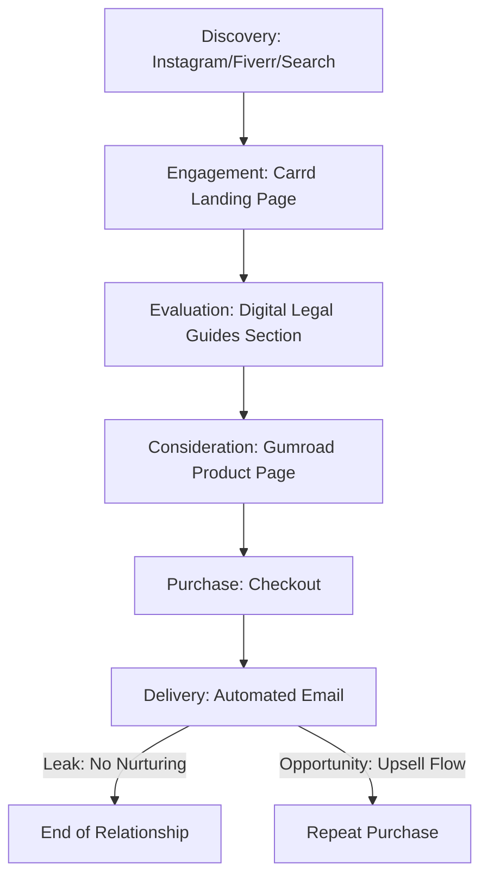

# Mexico Legal Guide - Comprehensive Sales & Marketing Audit

## 1. Platform Findings

### Carrd (mexicolegalguide.carrd.co)
- **Content:** Professional landing page for Sabrina Fernandez. Focuses on corporate legal advice for founders, startups, and SMEs.
- **CTAs:**
  - "The Problem With Corporate" (Section #one)
  - "Meet Sabrina Fernandez" (Section #two)
  - "Digital Legal Guides" (Section #three - Main CTA for products)
  - "Need Legal Advise?" (Email mailto link)
- **Links:** Direct links to Instagram, Gumroad, Fiverr, and LinkedIn.
- **Email Opt-in:** No direct email capture form found on the main Carrd page.
- **Post-purchase:** No dedicated "thank you" or follow-up page visible. It relies on platform-native (Gumroad) flows.

### Gumroad (mexicolegalguide.gumroad.com)
- **Active Products:**
  1.  **THE 7 LEGAL MISTAKES THAT DESTROY STARTUPS IN MEXICO** - $27
  2.  **Guide to Establishing Your Company in Mexico** - $49
  3.  **INTELLECTUAL PROPERTY FOR ENTREPRENEURS IN MEXICO** - $37
  4.  **CONTRACT GUIDE FOR FREELANCERS & CONSULTANTS IN MEXICO** - $35
  5.  **HOW TO HIRE CORRECTLY IN MEXICO** - $37
  6.  **Basic Compliance for Mexican SMEs** - $40
- **Bundles:** No product bundles are currently active.
- **Subscriptions:** Has a "Subscribe" form on the profile page, but it's separate from a lead magnet (no freebie offered in exchange for signing up).
- **Checkout:** Standard Gumroad checkout flow. Professional but lacks custom upsells.

### Instagram (@mexicolegalguide)
- **Content:** Educational content regarding legal tips in Mexico.
- **Link in Bio:** Links to the Carrd landing page.
- **Engagement:** High potential for discovery given the niche (legal advice for foreigners/founders).

---

## 2. Customer Journey Map (Current)

1.  **Discovery (Awareness):**
    - Instagram posts/reels.
    - Fiverr search for "Mexican corporate lawyer".
    - Organic search for legal guides.
2.  **Engagement (Interest):**
    - Visits Carrd landing page.
    - Reads Sabrina's bio and explores services.
3.  **Evaluation (Consideration):**
    - Clicks "Digital Legal Guides".
    - Navigates to Gumroad to view specific guide details and prices.
4.  **Purchase (Conversion):**
    - Completes purchase on Gumroad.
5.  **Post-Purchase (Loyalty):**
    - Receives digital file via Gumroad email.
    - *Leak:* No automated nurturing or cross-selling of other guides.

---

## 3. Leaks & Opportunities

- **Leak 1: No Lead Magnet.** Visitors who aren't ready to pay $30-$50 leave without giving an email.
- **Leak 2: No Product Bundling.** Users interested in one guide might want the whole "Startup Pack" but have to buy them individually.
- **Leak 3: Missing Migration Focus.** The business plan emphasizes visas and residency, but the store is 100% corporate/business law.
- **Opportunity 1: Retention Loop.** Automated email follow-up with a discount for a second guide.
- **Opportunity 2: Content Synergies.** Using specific Instagram posts to link directly to the relevant Gumroad product instead of just the Carrd homepage.

---

## 4. Specific Automation Recommendations

1.  **Lead Capture Automation:** Add a "Free Legal Checklist for Foreigners in Mexico" as a $0 product on Gumroad to capture emails.
2.  **Email Nurturing (Gumroad Workflows):**
    - **T+0:** Thank you + delivery.
    - **T+1 day:** "Did the guide help?" + educational tip.
    - **T+3 days:** "Ready to scale?" + 20% discount on the "Complete Business Bundle".
3.  **Social Media Auto-Posting:** Integrate Instagram with a scheduler that rotates "Legal Tip" posts with "Buy the Guide" stories.
4.  **Cross-Platform Sync:** Use Zapier to send Gumroad customers to a Mailchimp/ConvertKit list for a more robust newsletter strategy.
